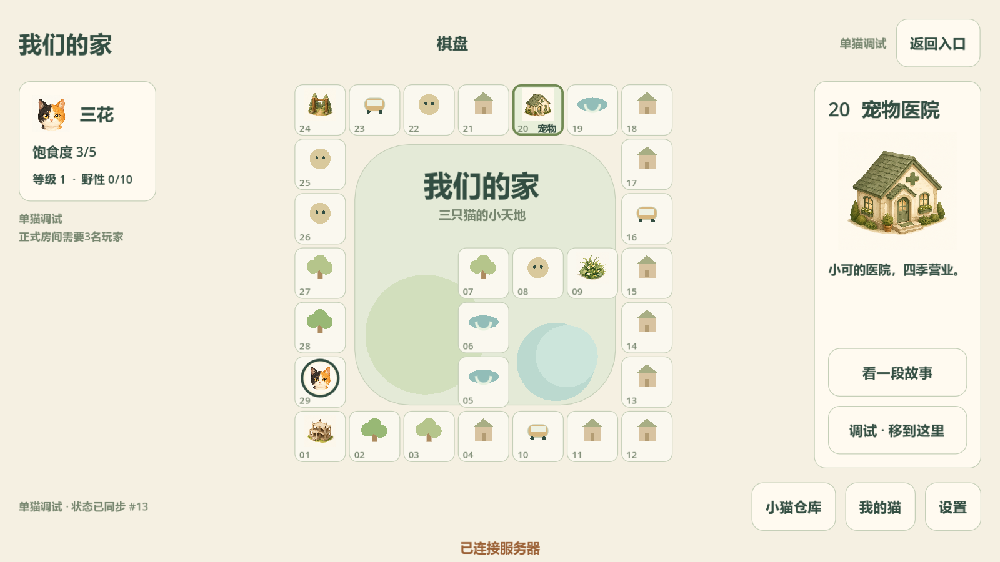
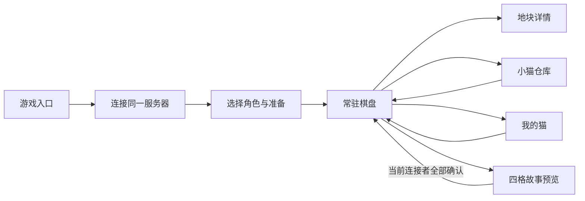

# Godot 棋盘首版

本轮将布局接入真实 Godot 4.6.1，提供一条能实际操作的接口预览流程。这里记录交付范围；逐例结论另见[本轮执行记录](../testing/执行记录/棋盘与本地联机_v001.md)，不把未制作功能当作通过。

[选角画面](godot_v001/room.png) · [四格接口预览](godot_v001/story.png)

## 界面之间怎样连接

仓库、我的猫、设置和四格故事覆盖在同一个棋盘上；打开关闭不重新创建会话或棋盘。地块详情固定在右边，选格与实际猫位置是两个状态：选格用于查看，调试按钮才向服务器请求位置变化。玩家状态固定在左边，主要操作留在下方。

“当前连接者全部确认”是本轮预览交互的助手实现选择；正式三人剧情的翻页、跳过、继续提交者与掉线恢复仍待裁定。预览来自原稿 6.png 的回烂尾楼、被施工人员赶出、另寻落脚处和森林公园小洞躲雨，固定使用非冬季语境。暂借地点插图预览四格容器，尚未完成专属叙事分镜；不发野性、猫草，不改月份和正式主线标记。

## 尺寸与图片区域

| 项目 | 当前规格 |
|---|---|
| 基础逻辑画面 / 最小窗口 | 1280×720 |
| 默认窗口 | 1600×900 |
| 验收窗口 | 1280×720、1600×900、1920×1080、2560×1080 |
| 缩放 | canvas_items + expand；同比缩放，超宽增加横向空间 |
| 棋盘 | 原稿7×7格位中的29格；正方形格子，按可用高度居中 |
| 常驻侧栏 | 左侧猫状态，右侧地块图与必要操作 |
| 头像 | 1254×1254候选原图；状态栏约48逻辑像素，棋子随格子变化 |
| 地块图 | 每格独立文件；正方形内等比绘制，详情另用较大图 |
| 常驻文字 | 保留编号；选中或悬停显示短地名，完整地点在详情/提示中 |

选择参考 Godot 4.6 的[多分辨率适配文档](https://docs.godotengine.org/en/4.6/tutorials/rendering/multiple_resolutions.html)。这些是已实现的工程参数；四组样本不能推广为所有 DPI、移动端或导出环境都通过。

原稿普通行走方向与岔路尚未明确，因此本版保持原格位而不将 1→29 解释成行走路线。调试操作清楚标示用途，正式三人模式由服务器禁止调试写入。

## 资源接入

三花、布偶、奶牛分别引用 `assets/art/cats/<角色>_token_v001.png`；地图只显示实际连接并选角的猫，没有用另外两只假玩家填满界面。原图不透明，棋盘使用圆形显示遮罩，保留原始 PNG；未将它们声称为带 alpha 的原图。

地块按 `assets/art/tiles/tile_编号_v001.png` 自动接入，下表用于逐格追踪。图片状态均为候选，正式风格尚未验收；四格预览借用地块图不等于四幅漫画已完成。

| 格号 | 原地点 | 当前图画文件 / 状态 |
|---|---|---|
| 01 | 烂尾楼 | [tile_01_v001.png](../../assets/art/tiles/tile_01_v001.png) · 候选已接入 |
| 02 | 草丛 | 临时原生图形占位；独立插图未制作 |
| 03 | 土路 | 临时原生图形占位；独立插图未制作 |
| 04 | 游乐场 | 临时原生图形占位；独立插图未制作 |
| 05 | 公园钓鱼点 | 临时原生图形占位；独立插图未制作 |
| 06 | 池塘入水口 | 临时原生图形占位；独立插图未制作 |
| 07 | 白沙池 | 临时原生图形占位；独立插图未制作 |
| 08 | 邪恶鹅大哥 | 临时原生图形占位；独立插图未制作 |
| 09 | 公园草丛 | [tile_09_v001.png](../../assets/art/tiles/tile_09_v001.png) · 候选已接入 |
| 10 | 10路公交车站 | 临时原生图形占位；独立插图未制作 |
| 11 | 广场 | 临时原生图形占位；独立插图未制作 |
| 12 | 下水道 | 临时原生图形占位；独立插图未制作 |
| 13 | 健身房 | 临时原生图形占位；独立插图未制作 |
| 14 | 餐馆 | 临时原生图形占位；独立插图未制作 |
| 15 | 幸福小区 | 临时原生图形占位；独立插图未制作 |
| 16 | 16路公交车站 | 临时原生图形占位；独立插图未制作 |
| 17 | 墓地 | 临时原生图形占位；独立插图未制作 |
| 18 | 废品处理厂 | 临时原生图形占位；独立插图未制作 |
| 19 | 小溪 | 临时原生图形占位；独立插图未制作 |
| 20 | 宠物医院 | [tile_20_v001.png](../../assets/art/tiles/tile_20_v001.png) · 候选已接入 |
| 21 | 公告栏 | 临时原生图形占位；独立插图未制作 |
| 22 | 海莉 | 临时原生图形占位；独立插图未制作 |
| 23 | 23路公交车站 | 临时原生图形占位；独立插图未制作 |
| 24 | 公园入口 | [tile_24_v001.png](../../assets/art/tiles/tile_24_v001.png) · 候选已接入 |
| 25 | 流浪猫聚集地 | 临时原生图形占位；独立插图未制作 |
| 26 | 丧彪 | 临时原生图形占位；独立插图未制作 |
| 27 | 树林 | 临时原生图形占位；独立插图未制作 |
| 28 | 养殖场 | 临时原生图形占位；独立插图未制作 |
| 29 | 草丛 | 临时原生图形占位；独立插图未制作 |

所有提示词、来源、尺寸、视觉检查和不符合项见[头像记录](../art/Q版棋盘头像_v001.md)和[地块记录](../art/棋盘地块样张_v001.md)。内置生成工具读取本地参考时发生 Windows 错误，本轮成功结果依赖文字描述，未实际传入参考图。各图底色与视角仍有轻微差别，后续固定角色设定和正式视觉基准时继续统一。

## 本轮接口及边界

本机试跑会创建独立 ENet 服务，再让当前窗口连接。正常房间仍要求三只不同角色、三位玩家准备；创建服务不增加主持人席位。状态更新从服务器返回，界面本身不改共享规则。连接等待最多10秒后明确失败；这是连接建立反馈，不是掉线后自动继续游戏的规则。

服务器断线时保留最后收到的棋盘与角色显示，禁用写入。剧情中断线可以返回入口，不能把退出当成已读或发奖励。重新连接与存档恢复尚未实现。详见[服务器文档](../本地服务器与联机接口.md)。

本轮已提供仓库和成长面板容器，尚未接物品操作与成长；还未实现骰子行走、月循环、战斗、濒死医院流程、正式剧情触发、结局、动画和音频。后续按原需求逐项接入这些功能，继续复用同一棋盘和弹层。

## 检查方式

`scripts/board_check.ps1` 保存源码/需求快照与素材哈希，执行导入、开局领域回归、独立服务 ENet 接口和图形输入。真实窗口截图保留在 `.artifacts/board-interface/<运行ID>/screenshots/`。图形测试采用 Godot 正常输入路由并考虑窗口缩放，不直接发按钮信号；尚未覆盖操作系统鼠标驱动。

原 M0 的 `scripts/self_test.ps1` 固定检查旧本地三猫场景，保留历史用例含义。新增 TC-BOARD 与正式 TC-PLAN 分开登记，不用单猫或同机多个网络 peer 代替三台设备验收。

## 尺寸稳定性补充

用户反馈界面分辨率持续变化后，新增REQ-UI-006/TC-BOARD-010。上轮四组尺寸通过仅是主动调整后的适配结论，未覆盖过程中的尺寸跳变；旧结果保留其原范围。现补正常操作60秒连续采样与完整29格反复查看，执行入口支持-StabilityOnly，主动尺寸轮转须-ResolutionSweep。用户现象与实测范围分别记录，详见[稳定性补测记录](../testing/执行记录/分辨率稳定性补测_v001.md)。
